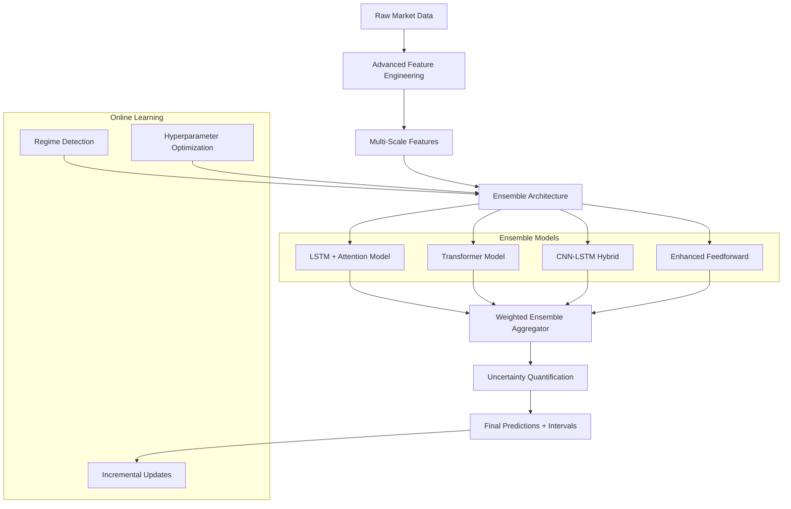
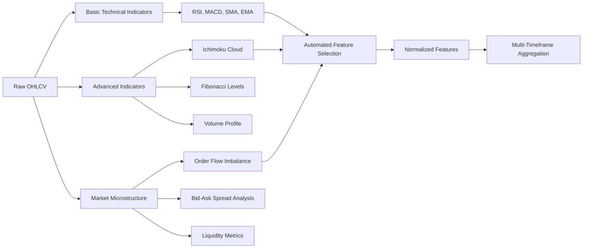

# Design Document

## Overview

The Advanced ML Improvements system enhances the existing stock prediction platform with state-of-the-art machine learning techniques including LSTM networks, attention mechanisms, ensemble methods, advanced feature engineering, and sophisticated uncertainty quantification. The design focuses on improving prediction accuracy, robustness, and providing better risk assessment capabilities.

## Architecture

### Enhanced ML Architecture



### Advanced Feature Engineering Pipeline



## Components and Interfaces

### 1. Advanced Neural Network Architectures

#### LSTM with Attention Model
```python
class LSTMAttentionPredictor(nn.Module):
    """LSTM with self-attention mechanism for temporal pattern recognition"""
    
    def __init__(self, input_size: int, hidden_size: int = 128, 
                 num_layers: int = 2, attention_heads: int = 8):
        super().__init__()
        self.lstm = nn.LSTM(input_size, hidden_size, num_layers, 
                           batch_first=True, dropout=0.2)
        self.attention = MultiHeadAttention(hidden_size, attention_heads)
        self.layer_norm = nn.LayerNorm(hidden_size)
        self.dropout = nn.Dropout(0.3)
        self.output_layer = nn.Linear(hidden_size, 1)
        
    def forward(self, x):
        # LSTM processing
        lstm_out, (hidden, cell) = self.lstm(x)
        
        # Self-attention mechanism
        attended = self.attention(lstm_out, lstm_out, lstm_out)
        attended = self.layer_norm(attended + lstm_out)  # Residual connection
        
        # Final prediction
        output = self.dropout(attended[:, -1, :])  # Use last timestep
        return self.output_layer(output)
```

#### Transformer-Based Model
```python
class TransformerPredictor(nn.Module):
    """Transformer architecture for stock prediction"""
    
    def __init__(self, input_size: int, d_model: int = 256, 
                 nhead: int = 8, num_layers: int = 6):
        super().__init__()
        self.input_projection = nn.Linear(input_size, d_model)
        self.positional_encoding = PositionalEncoding(d_model)
        
        encoder_layer = nn.TransformerEncoderLayer(
            d_model=d_model, nhead=nhead, dropout=0.1,
            activation='gelu', batch_first=True
        )
        self.transformer = nn.TransformerEncoder(encoder_layer, num_layers)
        
        self.output_layer = nn.Sequential(
            nn.LayerNorm(d_model),
            nn.Dropout(0.2),
            nn.Linear(d_model, 128),
            nn.GELU(),
            nn.Linear(128, 1)
        )
```

#### CNN-LSTM Hybrid Model
```python
class CNNLSTMPredictor(nn.Module):
    """Hybrid CNN-LSTM for pattern recognition and temporal modeling"""
    
    def __init__(self, input_size: int, sequence_length: int = 30):
        super().__init__()
        # 1D CNN for pattern extraction
        self.conv_layers = nn.Sequential(
            nn.Conv1d(input_size, 64, kernel_size=3, padding=1),
            nn.ReLU(),
            nn.BatchNorm1d(64),
            nn.Conv1d(64, 128, kernel_size=3, padding=1),
            nn.ReLU(),
            nn.BatchNorm1d(128),
            nn.AdaptiveAvgPool1d(sequence_length)
        )
        
        # LSTM for temporal dependencies
        self.lstm = nn.LSTM(128, 64, num_layers=2, batch_first=True)
        self.output_layer = nn.Linear(64, 1)
```

### 2. Ensemble Architecture

#### Weighted Ensemble Manager
```python
class EnsemblePredictor:
    """Manages multiple models and combines their predictions"""
    
    def __init__(self):
        self.models = {
            'lstm_attention': LSTMAttentionPredictor(),
            'transformer': TransformerPredictor(),
            'cnn_lstm': CNNLSTMPredictor(),
            'enhanced_ffn': EnhancedFeedforward()
        }
        self.weights = {}
        self.performance_history = {}
        
    def train_ensemble(self, train_data, val_data):
        """Train all models and calculate ensemble weights"""
        for name, model in self.models.items():
            # Train individual model
            performance = self.train_single_model(model, train_data, val_data)
            self.performance_history[name] = performance
            
        # Calculate dynamic weights based on validation performance
        self.update_ensemble_weights()
        
    def predict_with_ensemble(self, features):
        """Generate ensemble prediction with uncertainty"""
        predictions = {}
        confidences = {}
        
        for name, model in self.models.items():
            pred, conf = self.predict_with_uncertainty(model, features)
            predictions[name] = pred
            confidences[name] = conf
            
        # Weighted ensemble prediction
        ensemble_pred = sum(self.weights[name] * pred 
                          for name, pred in predictions.items())
        
        # Ensemble uncertainty (prediction variance + model disagreement)
        ensemble_uncertainty = self.calculate_ensemble_uncertainty(
            predictions, confidences
        )
        
        return ensemble_pred, ensemble_uncertainty, predictions
```

### 3. Advanced Feature Engineering

#### Market Microstructure Features
```python
class AdvancedFeatureEngineer:
    """Advanced feature engineering for market microstructure and patterns"""
    
    def __init__(self):
        self.feature_extractors = {
            'ichimoku': IchimokuExtractor(),
            'fibonacci': FibonacciExtractor(),
            'volume_profile': VolumeProfileExtractor(),
            'order_flow': OrderFlowExtractor(),
            'support_resistance': SupportResistanceExtractor(),
            'chart_patterns': ChartPatternExtractor()
        }
        
    def extract_advanced_features(self, price_data, volume_data):
        """Extract comprehensive feature set"""
        features = {}
        
        # Ichimoku Cloud indicators
        features.update(self.feature_extractors['ichimoku'].extract(price_data))
        
        # Fibonacci retracement levels
        features.update(self.feature_extractors['fibonacci'].extract(price_data))
        
        # Volume profile analysis
        features.update(self.feature_extractors['volume_profile'].extract(
            price_data, volume_data
        ))
        
        # Market microstructure (if available)
        if self.has_level2_data():
            features.update(self.feature_extractors['order_flow'].extract())
            
        # Support/resistance levels
        features.update(self.feature_extractors['support_resistance'].extract(
            price_data
        ))
        
        # Chart pattern recognition
        features.update(self.feature_extractors['chart_patterns'].extract(
            price_data
        ))
        
        return features
```

#### Automated Feature Selection
```python
class AutoFeatureSelector:
    """Automated feature selection using multiple methods"""
    
    def __init__(self):
        self.selection_methods = {
            'mutual_info': mutual_info_regression,
            'f_regression': f_regression,
            'recursive_fe': RFE,
            'lasso': SelectFromModel(Lasso()),
            'tree_importance': SelectFromModel(RandomForestRegressor())
        }
        
    def select_features(self, X, y, method='ensemble'):
        """Select most predictive features"""
        if method == 'ensemble':
            # Combine multiple selection methods
            selected_features = self.ensemble_feature_selection(X, y)
        else:
            selected_features = self.single_method_selection(X, y, method)
            
        return selected_features
        
    def ensemble_feature_selection(self, X, y):
        """Use ensemble of selection methods"""
        feature_scores = {}
        
        for method_name, selector in self.selection_methods.items():
            if hasattr(selector, 'fit_transform'):
                selector.fit(X, y)
                scores = selector.scores_ if hasattr(selector, 'scores_') else selector.feature_importances_
            else:
                scores = selector(X, y)[0]
                
            # Normalize scores
            normalized_scores = (scores - scores.min()) / (scores.max() - scores.min())
            
            for i, score in enumerate(normalized_scores):
                if i not in feature_scores:
                    feature_scores[i] = []
                feature_scores[i].append(score)
        
        # Average scores across methods
        final_scores = {i: np.mean(scores) for i, scores in feature_scores.items()}
        
        # Select top features
        sorted_features = sorted(final_scores.items(), key=lambda x: x[1], reverse=True)
        selected_indices = [idx for idx, score in sorted_features[:50]]  # Top 50 features
        
        return selected_indices
```

### 4. Uncertainty Quantification

#### Bayesian Neural Networks
```python
class BayesianPredictor(nn.Module):
    """Bayesian neural network for uncertainty quantification"""
    
    def __init__(self, input_size: int, hidden_sizes: List[int]):
        super().__init__()
        self.layers = nn.ModuleList()
        
        prev_size = input_size
        for hidden_size in hidden_sizes:
            self.layers.append(BayesianLinear(prev_size, hidden_size))
            prev_size = hidden_size
            
        self.output_layer = BayesianLinear(prev_size, 1)
        
    def forward(self, x, sample=True):
        """Forward pass with optional weight sampling"""
        for layer in self.layers:
            x = torch.relu(layer(x, sample))
        return self.output_layer(x, sample)
        
    def predict_with_uncertainty(self, x, n_samples=100):
        """Generate predictions with epistemic uncertainty"""
        predictions = []
        
        for _ in range(n_samples):
            pred = self.forward(x, sample=True)
            predictions.append(pred.detach())
            
        predictions = torch.stack(predictions)
        mean_pred = predictions.mean(dim=0)
        uncertainty = predictions.std(dim=0)
        
        return mean_pred, uncertainty
```

#### Monte Carlo Dropout Enhanced
```python
class MCDropoutPredictor:
    """Enhanced Monte Carlo Dropout for uncertainty estimation"""
    
    def __init__(self, model, dropout_rate=0.3):
        self.model = model
        self.dropout_rate = dropout_rate
        
    def enable_dropout(self):
        """Enable dropout during inference"""
        for module in self.model.modules():
            if isinstance(module, nn.Dropout):
                module.train()
                
    def predict_with_uncertainty(self, x, n_samples=100, confidence_level=0.95):
        """Generate prediction intervals using MC Dropout"""
        self.enable_dropout()
        predictions = []
        
        with torch.no_grad():
            for _ in range(n_samples):
                pred = self.model(x)
                predictions.append(pred.cpu().numpy())
                
        predictions = np.array(predictions)
        
        # Calculate statistics
        mean_pred = np.mean(predictions, axis=0)
        std_pred = np.std(predictions, axis=0)
        
        # Prediction intervals
        alpha = 1 - confidence_level
        lower_percentile = (alpha / 2) * 100
        upper_percentile = (1 - alpha / 2) * 100
        
        lower_bound = np.percentile(predictions, lower_percentile, axis=0)
        upper_bound = np.percentile(predictions, upper_percentile, axis=0)
        
        return {
            'prediction': mean_pred,
            'uncertainty': std_pred,
            'lower_bound': lower_bound,
            'upper_bound': upper_bound,
            'confidence_level': confidence_level
        }
```

### 5. Market Regime Detection

#### Multi-Method Regime Classifier
```python
class MarketRegimeDetector:
    """Detect market regimes using multiple methods"""
    
    def __init__(self):
        self.methods = {
            'hmm': GaussianHMM(n_components=3),  # Bull, Bear, Sideways
            'clustering': KMeans(n_clusters=3),
            'volatility': VolatilityRegimeDetector(),
            'trend': TrendRegimeDetector()
        }
        self.regime_history = []
        
    def detect_regime(self, price_data, volume_data, indicators):
        """Detect current market regime"""
        features = self.prepare_regime_features(price_data, volume_data, indicators)
        
        regime_votes = {}
        for method_name, detector in self.methods.items():
            regime = detector.predict(features)
            regime_votes[method_name] = regime
            
        # Ensemble regime decision
        final_regime = self.ensemble_regime_decision(regime_votes)
        self.regime_history.append(final_regime)
        
        return final_regime
        
    def get_regime_specific_model(self, regime):
        """Return model optimized for specific regime"""
        if regime == 'bull':
            return self.bull_market_model
        elif regime == 'bear':
            return self.bear_market_model
        else:
            return self.sideways_market_model
```

### 6. Online Learning System

#### Incremental Learning Manager
```python
class OnlineLearningManager:
    """Manages incremental model updates"""
    
    def __init__(self, models, learning_rate=0.001):
        self.models = models
        self.base_learning_rate = learning_rate
        self.performance_tracker = PerformanceTracker()
        self.concept_drift_detector = ConceptDriftDetector()
        
    def incremental_update(self, new_data, new_targets):
        """Update models with new data"""
        # Detect concept drift
        drift_detected = self.concept_drift_detector.detect_drift(
            new_data, new_targets
        )
        
        if drift_detected:
            # Increase learning rate for faster adaptation
            current_lr = self.base_learning_rate * 2
            logger.info("Concept drift detected, increasing learning rate")
        else:
            current_lr = self.base_learning_rate
            
        # Update each model
        for name, model in self.models.items():
            self.update_single_model(model, new_data, new_targets, current_lr)
            
        # Update performance tracking
        self.performance_tracker.update(new_data, new_targets)
        
    def should_retrain(self):
        """Determine if full retraining is needed"""
        recent_performance = self.performance_tracker.get_recent_performance()
        performance_threshold = 0.6
        
        return recent_performance < performance_threshold
```

### 7. Hyperparameter Optimization

#### Bayesian Optimization System
```python
class HyperparameterOptimizer:
    """Bayesian optimization for hyperparameter tuning"""
    
    def __init__(self):
        self.optimization_space = {
            'learning_rate': (1e-5, 1e-1, 'log-uniform'),
            'batch_size': (16, 256, 'int'),
            'hidden_size': (32, 512, 'int'),
            'num_layers': (1, 6, 'int'),
            'dropout_rate': (0.1, 0.5, 'uniform'),
            'attention_heads': (2, 16, 'int')
        }
        
    def optimize(self, model_class, train_data, val_data, n_trials=50):
        """Optimize hyperparameters using Bayesian optimization"""
        
        def objective(params):
            # Create model with suggested parameters
            model = model_class(**params)
            
            # Train and evaluate
            trainer = ModelTrainer(model)
            results = trainer.train(train_data, val_data)
            
            # Return negative validation loss (minimize)
            return -results['val_loss']
            
        # Use Optuna for Bayesian optimization
        study = optuna.create_study(direction='maximize')
        study.optimize(objective, n_trials=n_trials)
        
        return study.best_params
```

## Data Models

### Enhanced Prediction Result
```python
@dataclass
class AdvancedPredictionResult:
    symbol: str
    timestamp: datetime
    
    # Multi-timeframe predictions
    predictions_1d: float
    predictions_3d: float
    predictions_5d: float
    predictions_10d: float
    
    # Ensemble details
    ensemble_prediction: float
    individual_predictions: Dict[str, float]
    model_weights: Dict[str, float]
    
    # Uncertainty quantification
    prediction_intervals: Dict[str, Tuple[float, float]]  # confidence_level -> (lower, upper)
    epistemic_uncertainty: float
    aleatoric_uncertainty: float
    total_uncertainty: float
    
    # Market context
    market_regime: str
    regime_confidence: float
    volatility_regime: str
    
    # Feature importance
    feature_importance: Dict[str, float]
    top_contributing_features: List[str]
    
    # Risk metrics
    risk_level: str
    position_sizing_recommendation: float
    stop_loss_suggestion: float
    
    # Model diagnostics
    model_agreement: float  # How much models agree
    prediction_stability: float
    confidence_calibration: float
```

### Advanced Performance Metrics
```python
@dataclass
class AdvancedPerformanceMetrics:
    # Traditional metrics
    mae: float
    mse: float
    rmse: float
    directional_accuracy: float
    
    # Advanced metrics
    sharpe_ratio: float
    maximum_drawdown: float
    calmar_ratio: float
    sortino_ratio: float
    
    # Uncertainty metrics
    prediction_interval_coverage: Dict[str, float]  # confidence_level -> coverage
    uncertainty_calibration: float
    expected_calibration_error: float
    
    # Multi-timeframe metrics
    accuracy_by_horizon: Dict[str, float]
    consistency_across_horizons: float
    
    # Regime-specific performance
    performance_by_regime: Dict[str, Dict[str, float]]
    
    # Feature analysis
    feature_stability: float
    feature_importance_consistency: float
    
    # Risk-adjusted metrics
    value_at_risk_95: float
    conditional_value_at_risk: float
    maximum_consecutive_losses: int
```

## Error Handling

### Advanced Error Recovery
- **Model Failure Handling**: Automatic fallback to simpler models when advanced architectures fail
- **Ensemble Robustness**: Continue operation even if individual models fail
- **Online Learning Errors**: Graceful degradation when incremental updates fail
- **Hyperparameter Optimization Failures**: Use default parameters with performance monitoring

### Uncertainty-Aware Error Handling
- **High Uncertainty Detection**: Automatically flag predictions with high uncertainty
- **Regime Change Handling**: Adjust error thresholds based on market regime
- **Concept Drift Response**: Trigger retraining when drift is detected

## Testing Strategy

### Advanced Model Testing
- **Cross-Validation**: Time series cross-validation with walk-forward analysis
- **Ensemble Testing**: Validate ensemble performance vs individual models
- **Uncertainty Calibration**: Test prediction interval coverage
- **Regime Testing**: Validate performance across different market conditions

### Performance Testing
- **Scalability Testing**: Test with large datasets and multiple models
- **Real-time Performance**: Ensure predictions meet latency requirements
- **Memory Efficiency**: Monitor memory usage with ensemble models

## Security Considerations

### Model Security
- **Model Poisoning Protection**: Validate training data quality
- **Adversarial Robustness**: Test against adversarial examples
- **Model Extraction Protection**: Secure model weights and architecture

### Data Security
- **Feature Engineering Security**: Validate feature calculations
- **Online Learning Security**: Secure incremental updates
- **Hyperparameter Security**: Protect optimization results

## Performance Optimization

### Computational Efficiency
- **Model Parallelization**: Parallel training of ensemble members
- **GPU Optimization**: Efficient GPU utilization for large models
- **Caching**: Cache feature calculations and model predictions
- **Batch Processing**: Optimize batch sizes for different models

### Memory Optimization
- **Model Compression**: Quantization and pruning for deployment
- **Gradient Checkpointing**: Reduce memory usage during training
- **Efficient Data Loading**: Optimized data pipelines

### Advanced Analytics Integration
- **Real-time Monitoring**: Monitor all models and ensemble performance
- **Automated Reporting**: Generate comprehensive performance reports
- **Alert System**: Notify when performance degrades or uncertainty increases
- **Visualization**: Advanced charts for ensemble predictions and uncertainty