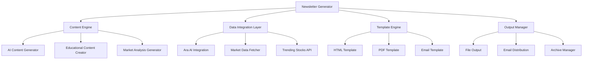

# Design Document

## Overview

The AI Financial Newsletter system is a Python-based application that generates engaging, educational weekly newsletters for young investors aged 14-25. The system integrates with the existing Ara AI stock prediction system and leverages AI content generation APIs (such as Llama) to create personalized financial insights, market analysis, and investment education content.

The system follows a modular architecture with clear separation between content generation, data integration, formatting, and distribution components. It emphasizes automation, educational value, and age-appropriate communication while maintaining accuracy and reliability in financial information.

## Architecture

### High-Level Architecture



### System Components

1. **Newsletter Generator (Main Controller)**
   - Orchestrates the entire newsletter generation process
   - Manages configuration and scheduling
   - Handles error recovery and fallback mechanisms

2. **Content Engine**
   - AI Content Generator: Interfaces with AI APIs for dynamic content
   - Educational Content Creator: Generates age-appropriate financial education
   - Market Analysis Generator: Creates trend analysis and volatility insights

3. **Data Integration Layer**
   - Ara AI Integration: Fetches stock predictions from existing system
   - Market Data Fetcher: Retrieves current market data and news
   - Trending Stocks API: Identifies popular and trending stocks

4. **Template Engine**
   - Manages newsletter formatting and layout
   - Supports multiple output formats (HTML, PDF, Email)
   - Handles responsive design for mobile viewing

5. **Output Manager**
   - File generation and storage
   - Email distribution capabilities
   - Archive management and version control

## Components and Interfaces

### Core Classes

#### NewsletterGenerator
```python
class NewsletterGenerator:
    def __init__(self, config: NewsletterConfig):
        self.config = config
        self.content_engine = ContentEngine(config.ai_config)
        self.data_layer = DataIntegrationLayer(config.data_config)
        self.template_engine = TemplateEngine(config.template_config)
        self.output_manager = OutputManager(config.output_config)
    
    def generate_weekly_newsletter(self) -> NewsletterResult:
        """Main method to generate complete newsletter"""
        pass
    
    def validate_content(self, content: NewsletterContent) -> bool:
        """Validate generated content for accuracy and appropriateness"""
        pass
```

#### ContentEngine
```python
class ContentEngine:
    def __init__(self, ai_config: AIConfig):
        self.ai_client = self._initialize_ai_client(ai_config)
        self.educational_generator = EducationalContentGenerator()
        self.market_analyzer = MarketAnalysisGenerator()
    
    def generate_market_insights(self, market_data: MarketData) -> str:
        """Generate AI-powered market insights"""
        pass
    
    def create_educational_content(self, topic: str, difficulty: str) -> str:
        """Create age-appropriate educational content"""
        pass
    
    def generate_investment_ideas(self, predictions: List[StockPrediction]) -> str:
        """Generate actionable investment ideas"""
        pass
```

#### DataIntegrationLayer
```python
class DataIntegrationLayer:
    def __init__(self, data_config: DataConfig):
        self.ara_client = AraAIClient()
        self.market_fetcher = MarketDataFetcher()
        self.trending_fetcher = TrendingStocksFetcher()
    
    def get_stock_predictions(self, symbols: List[str]) -> List[StockPrediction]:
        """Fetch predictions from Ara AI system"""
        pass
    
    def get_trending_stocks(self, count: int = 10) -> List[str]:
        """Get currently trending stock symbols"""
        pass
    
    def get_market_overview(self) -> MarketOverview:
        """Get current market conditions and news"""
        pass
```

### Data Models

#### NewsletterContent
```python
@dataclass
class NewsletterContent:
    header: NewsletterHeader
    market_insights: str
    stock_predictions: List[StockPredictionSection]
    educational_section: str
    volatility_analysis: str
    investment_ideas: str
    footer: NewsletterFooter
    metadata: NewsletterMetadata
```

#### StockPrediction
```python
@dataclass
class StockPrediction:
    symbol: str
    current_price: float
    predicted_prices: List[float]  # 1-day, 3-day, 7-day predictions
    confidence: float
    trend_direction: str
    risk_level: str
    educational_context: str
```

#### NewsletterConfig
```python
@dataclass
class NewsletterConfig:
    ai_config: AIConfig
    data_config: DataConfig
    template_config: TemplateConfig
    output_config: OutputConfig
    content_settings: ContentSettings
```

### API Interfaces

#### AI Content Generation Interface
```python
class AIContentGeneratorInterface:
    def generate_content(self, prompt: str, context: Dict) -> str:
        """Generate content using AI API"""
        pass
    
    def validate_content_appropriateness(self, content: str) -> bool:
        """Validate content is appropriate for target age group"""
        pass
```

#### Ara AI Integration Interface
```python
class AraAIInterface:
    def get_predictions(self, symbol: str) -> StockPrediction:
        """Get stock predictions from existing Ara system"""
        pass
    
    def get_accuracy_metrics(self) -> AccuracyMetrics:
        """Get current prediction accuracy statistics"""
        pass
```

## Data Models

### Database Schema (SQLite)

#### newsletters Table
```sql
CREATE TABLE newsletters (
    id INTEGER PRIMARY KEY AUTOINCREMENT,
    week_identifier TEXT UNIQUE NOT NULL,
    generation_date TIMESTAMP DEFAULT CURRENT_TIMESTAMP,
    content_hash TEXT NOT NULL,
    file_path TEXT NOT NULL,
    email_sent BOOLEAN DEFAULT FALSE,
    metadata JSON
);
```

#### stock_predictions_used Table
```sql
CREATE TABLE stock_predictions_used (
    id INTEGER PRIMARY KEY AUTOINCREMENT,
    newsletter_id INTEGER,
    symbol TEXT NOT NULL,
    prediction_date TIMESTAMP,
    predicted_price REAL,
    confidence REAL,
    actual_price REAL,
    accuracy_validated BOOLEAN DEFAULT FALSE,
    FOREIGN KEY (newsletter_id) REFERENCES newsletters (id)
);
```

#### content_topics Table
```sql
CREATE TABLE content_topics (
    id INTEGER PRIMARY KEY AUTOINCREMENT,
    newsletter_id INTEGER,
    topic_category TEXT NOT NULL,
    topic_title TEXT NOT NULL,
    content_length INTEGER,
    ai_generated BOOLEAN DEFAULT TRUE,
    FOREIGN KEY (newsletter_id) REFERENCES newsletters (id)
);
```

### Configuration Files

#### newsletter_config.json
```json
{
    "ai_config": {
        "provider": "llama",
        "api_endpoint": "https://api.llama-api.com/chat/completions",
        "model": "llama-2-70b-chat",
        "max_tokens": 2000,
        "temperature": 0.7,
        "fallback_provider": "openai"
    },
    "content_settings": {
        "target_age_range": [14, 25],
        "reading_level": "high_school",
        "tone": "friendly_educational",
        "max_newsletter_length": 5000,
        "sections": {
            "market_insights": true,
            "stock_predictions": true,
            "educational_content": true,
            "volatility_analysis": true,
            "investment_ideas": true,
            "weekly_challenge": true
        }
    },
    "stock_selection": {
        "always_include": ["AAPL", "TSLA", "NVDA", "MSFT"],
        "trending_count": 6,
        "popular_stocks": ["GOOGL", "AMZN", "META", "NFLX", "AMD"],
        "max_total_stocks": 10
    }
}
```

## Error Handling

### Error Recovery Strategies

1. **AI API Failures**
   - Fallback to secondary AI provider
   - Use pre-generated template content
   - Reduce content complexity and retry

2. **Ara AI Integration Failures**
   - Use cached predictions from previous runs
   - Generate conservative market analysis
   - Include disclaimer about data limitations

3. **Market Data Failures**
   - Use Yahoo Finance as backup data source
   - Generate newsletter with available data
   - Include data freshness warnings

4. **Content Validation Failures**
   - Apply content filters and regenerate
   - Use human-reviewed template content
   - Flag for manual review before distribution

### Logging and Monitoring

```python
class NewsletterLogger:
    def __init__(self):
        self.logger = logging.getLogger('newsletter_generator')
        self.setup_handlers()
    
    def log_generation_start(self, week_id: str):
        """Log newsletter generation start"""
        pass
    
    def log_ai_api_call(self, provider: str, tokens_used: int):
        """Log AI API usage"""
        pass
    
    def log_content_validation(self, section: str, passed: bool):
        """Log content validation results"""
        pass
    
    def log_error(self, error: Exception, context: Dict):
        """Log errors with context"""
        pass
```

## Testing Strategy

### Unit Testing

1. **Content Generation Tests**
   - Mock AI API responses
   - Test content validation logic
   - Verify age-appropriate language

2. **Data Integration Tests**
   - Mock Ara AI responses
   - Test market data fetching
   - Validate data transformation

3. **Template Engine Tests**
   - Test HTML/PDF generation
   - Verify responsive design
   - Test email formatting

### Integration Testing

1. **End-to-End Newsletter Generation**
   - Full pipeline testing with test data
   - Validate output quality
   - Test error recovery scenarios

2. **AI API Integration**
   - Test with real AI providers
   - Validate content quality
   - Test rate limiting and retries

3. **Ara AI Integration**
   - Test with actual prediction data
   - Validate data accuracy
   - Test performance with multiple stocks

### Content Quality Testing

1. **Educational Content Validation**
   - Age-appropriateness testing
   - Financial accuracy verification
   - Readability analysis

2. **Market Analysis Testing**
   - Compare AI insights with expert analysis
   - Validate prediction interpretation
   - Test volatility analysis accuracy

### Performance Testing

1. **Generation Speed**
   - Target: Complete newsletter in under 5 minutes
   - Test with various stock counts
   - Optimize AI API call efficiency

2. **Resource Usage**
   - Memory usage monitoring
   - API rate limit compliance
   - File system performance

### User Acceptance Testing

1. **Target Audience Feedback**
   - Test with 14-25 age group
   - Gather engagement metrics
   - Validate educational effectiveness

2. **Content Engagement**
   - Track reading completion rates
   - Monitor click-through rates
   - Measure learning outcomes