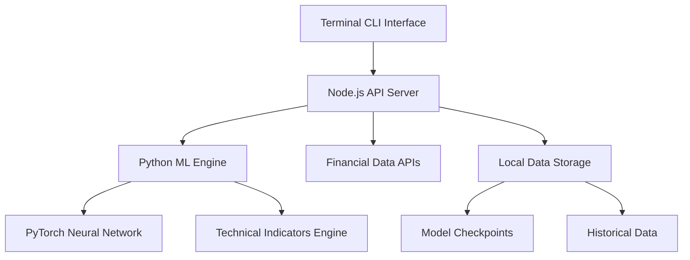
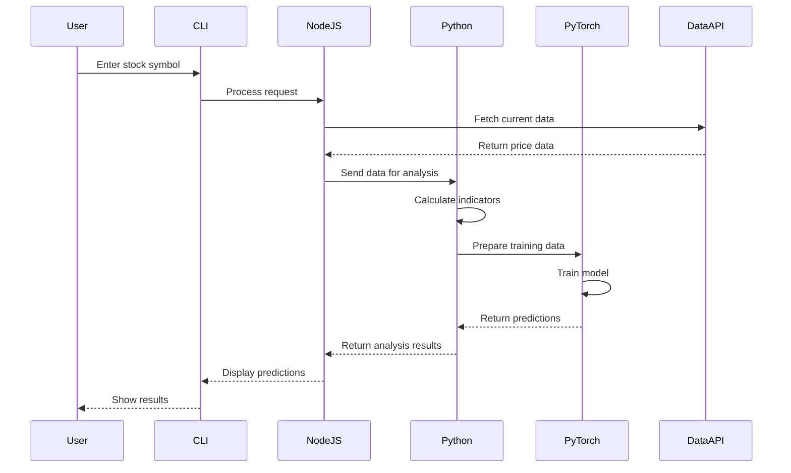

# Design Document

## Overview

The ML Stock Predictor is a hybrid platform combining Python's machine learning capabilities with Node.js for API orchestration and terminal interface management. The system uses PyTorch for neural network implementation, integrates multiple financial data sources, and provides real-time stock analysis with next-day price predictions through a command-line interface.

## Architecture

### High-Level Architecture



### Component Interaction Flow



## Components and Interfaces

### 1. Terminal CLI Interface (Node.js)
- **Purpose**: Primary user interaction point
- **Technology**: Node.js with Commander.js for CLI parsing
- **Responsibilities**:
  - Command parsing and validation
  - User input/output management
  - Progress indicators and status updates
  - Error handling and user feedback

### 2. API Orchestration Layer (Node.js)
- **Purpose**: Coordinate between CLI, Python ML engine, and external APIs
- **Technology**: Express.js for internal API, Axios for external calls
- **Responsibilities**:
  - Financial data API integration
  - Python process management
  - Data validation and preprocessing
  - Response formatting and caching

### 3. Machine Learning Engine (Python)
- **Purpose**: Core ML functionality and technical analysis
- **Technology**: Python with PyTorch, NumPy, Pandas
- **Responsibilities**:
  - Technical indicator calculations
  - Neural network model definition
  - Training and inference operations
  - Model serialization and loading

### 4. Neural Network Model (PyTorch)
- **Architecture**: Multi-layer feedforward network
- **Input Features**: 
  - OHLCV data (Open, High, Low, Close, Volume)
  - Technical indicators (RSI, MACD, SMA, EMA, Bollinger Bands, Stochastic, Williams %R, CCI)
  - Normalized price changes
- **Output**: Next-day price prediction with confidence score

### 5. Data Storage Layer
- **Technology**: SQLite for local persistence
- **Schema**:
  - Stock data table (symbol, date, OHLCV, indicators)
  - Model metadata table (version, performance metrics, timestamp)
  - Training history table (epochs, loss, accuracy)

## Data Models

### Stock Data Model
```python
class StockData:
    symbol: str
    date: datetime
    open_price: float
    high_price: float
    low_price: float
    close_price: float
    volume: int
    indicators: Dict[str, float]
```

### Prediction Model
```python
class PredictionResult:
    symbol: str
    current_price: float
    predicted_price: float
    direction: str  # 'UP' or 'DOWN'
    confidence: float
    risk_level: str
    timestamp: datetime
    error_metrics: Dict[str, float]  # MAE, MSE, RMSE
    feature_importance: Dict[str, float]
    prediction_stability: float
    
class PerformanceMetrics:
    directional_accuracy: float
    mae: float  # Mean Absolute Error
    mse: float  # Mean Squared Error
    rmse: float  # Root Mean Squared Error
    profit_loss_simulation: float
    rolling_accuracy_1d: float
    rolling_accuracy_7d: float
    rolling_accuracy_30d: float
    confidence_distribution: Dict[str, float]
    
class ModelDiagnostics:
    training_loss: List[float]
    validation_loss: List[float]
    convergence_metrics: Dict[str, float]
    overfitting_score: float
    feature_importance_scores: Dict[str, float]
    uncertainty_metrics: Dict[str, float]
    stability_score: float
```

### Neural Network Architecture
```python
class StockPredictor(nn.Module):
    def __init__(self, input_size=13, hidden_sizes=[64, 32, 16], output_size=1):
        # Input: OHLCV (5) + Technical Indicators (8) = 13 features
        # Hidden layers with dropout for regularization
        # Output: Single price prediction value
```

## Technical Indicators Implementation

### Core Indicators
1. **RSI (Relative Strength Index)**: Momentum oscillator (0-100)
2. **MACD (Moving Average Convergence Divergence)**: Trend-following momentum
3. **SMA/EMA (Simple/Exponential Moving Averages)**: Trend identification
4. **Bollinger Bands**: Volatility and price level indicator
5. **Stochastic Oscillator**: Momentum indicator comparing closing price to price range
6. **Williams %R**: Momentum indicator measuring overbought/oversold levels
7. **CCI (Commodity Channel Index)**: Cyclical trend indicator
8. **Volume indicators**: Volume-weighted metrics

### Feature Engineering
- Normalize all indicators to 0-1 range using MinMaxScaler
- Create rolling windows for temporal patterns
- Calculate price change percentages
- Handle missing values with forward fill and interpolation

## Error Handling

### API Integration Errors
- **Rate Limiting**: Implement exponential backoff with jitter
- **Network Failures**: Retry mechanism with circuit breaker pattern
- **Invalid Responses**: Data validation with fallback to cached data
- **Authentication Issues**: Clear error messages with resolution steps

### Machine Learning Errors
- **Training Failures**: Graceful degradation to simpler models
- **Prediction Errors**: Confidence thresholds and uncertainty quantification
- **Data Quality Issues**: Outlier detection and data cleaning
- **Model Loading Errors**: Fallback to default model weights

### System Errors
- **File I/O Errors**: Robust file handling with backup mechanisms
- **Memory Issues**: Batch processing for large datasets
- **Process Communication**: Error handling between Node.js and Python
- **Database Errors**: Transaction rollback and data integrity checks

## Testing Strategy

### Unit Testing
- **Python Components**: pytest for ML functions and indicator calculations
- **Node.js Components**: Jest for API endpoints and CLI functions
- **Model Testing**: Synthetic data validation and performance benchmarks

### Integration Testing
- **API Integration**: Mock external financial APIs for consistent testing
- **Process Communication**: Test Node.js to Python data exchange
- **End-to-End Workflows**: Complete user journey testing

### Performance Testing
- **Model Training Speed**: Benchmark training times with different data sizes
- **Prediction Latency**: Measure inference time for real-time requirements
- **Memory Usage**: Profile memory consumption during operations
- **API Response Times**: Monitor external API call performance

### Data Quality Testing
- **Indicator Accuracy**: Validate technical indicators against known values
- **Data Consistency**: Check for data integrity across storage operations
- **Edge Case Handling**: Test with missing data, market holidays, extreme values

## Security Considerations

### API Security
- Store API keys in environment variables
- Implement rate limiting to prevent abuse
- Use HTTPS for all external API calls
- Validate and sanitize all input data

### Data Protection
- Encrypt sensitive data at rest
- Implement secure model serialization
- Use secure random number generation for model initialization
- Regular security updates for dependencies

## Performance Metrics and Analytics

### Error Rate Tracking
- **Real-time Error Calculation**: Continuous MAE, MSE, RMSE computation
- **Directional Accuracy**: Track percentage of correct up/down predictions
- **Rolling Window Analysis**: 1-day, 7-day, 30-day accuracy trends
- **Confidence Calibration**: Measure how well confidence scores match actual accuracy
- **Error Distribution Analysis**: Histogram of prediction errors by magnitude

### Model Performance Dashboard
```python
class PerformanceDashboard:
    def display_metrics(self):
        # Real-time metrics display
        # Training/validation loss curves
        # Feature importance rankings
        # Prediction confidence distribution
        # Error rate trends over time
        # Profit/loss simulation results
```

### Feature Importance Analysis
- **SHAP Values**: Explain individual predictions with feature contributions
- **Permutation Importance**: Measure feature impact on model performance
- **Correlation Analysis**: Track relationships between indicators and accuracy
- **Stability Metrics**: Monitor feature importance consistency over time

### Model Diagnostics
- **Overfitting Detection**: Compare training vs validation performance
- **Convergence Monitoring**: Track loss function optimization progress
- **Gradient Analysis**: Monitor gradient flow and vanishing gradient issues
- **Learning Rate Optimization**: Adaptive learning rate based on performance

### Comprehensive Logging System
```python
class MetricsLogger:
    def log_prediction(self, prediction, actual, features):
        # Log individual prediction with full context
        # Calculate and store error metrics
        # Update rolling statistics
        # Trigger alerts for performance degradation
        
    def generate_performance_report(self):
        # Daily/weekly/monthly performance summaries
        # Model comparison reports
        # Feature importance evolution
        # Recommendation for model improvements
```

### Real-time Monitoring
- **System Resource Usage**: CPU, memory, disk I/O tracking
- **API Response Times**: Monitor external data source latency
- **Database Performance**: Query execution time and optimization suggestions
- **Model Inference Speed**: Track prediction generation time
- **Error Rate Alerts**: Automatic notifications when accuracy drops

### Profit/Loss Simulation
- **Trading Strategy Simulation**: Test predictions with various trading strategies
- **Risk-Adjusted Returns**: Calculate Sharpe ratio and maximum drawdown
- **Transaction Cost Modeling**: Include realistic trading costs in simulations
- **Portfolio Performance**: Track cumulative returns over time

## Performance Optimization

### Model Optimization
- Use GPU acceleration when available
- Implement model quantization for faster inference
- Batch processing for multiple predictions
- Model pruning to reduce size and complexity
- Dynamic model selection based on market conditions

### Data Processing
- Implement caching for frequently accessed data
- Use vectorized operations with NumPy/Pandas
- Optimize database queries with proper indexing
- Stream processing for large datasets
- Parallel indicator calculation

### System Performance
- Asynchronous operations in Node.js
- Connection pooling for database operations
- Memory-efficient data structures
- Profiling and monitoring tools integration
- Automatic performance tuning based on usage patterns

### Advanced Analytics Features
- **Market Regime Detection**: Identify bull/bear/sideways markets for model adaptation
- **Volatility Clustering**: Detect periods of high/low volatility for risk adjustment
- **Anomaly Detection**: Identify unusual market conditions that may affect predictions
- **Multi-timeframe Analysis**: Combine predictions across different time horizons
- **Ensemble Methods**: Combine multiple models for improved accuracy