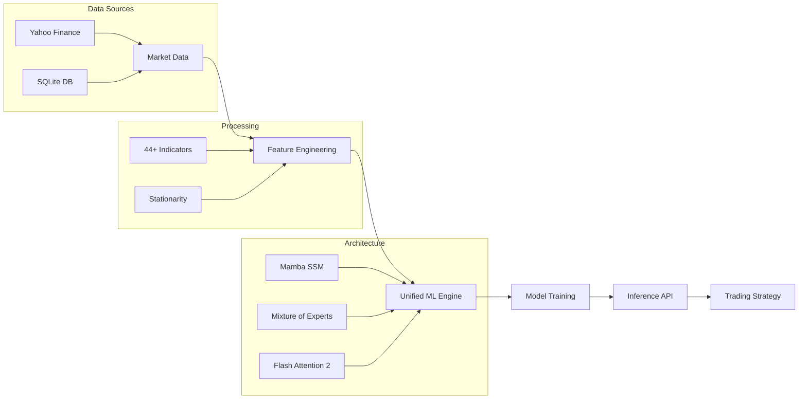

# ARA AI: Advanced Financial Prediction Platform

## High-Performance Machine Learning for Financial Time Series Analysis


[](https://github.com/MeridianAlgo/AraAI/actions/workflows/train-forex.yml)
[](https://github.com/MeridianAlgo/AraAI/actions/workflows/train-stock.yml)
[](https://github.com/MeridianAlgo/AraAI/actions/workflows/lint.yml)
---

## Table of Contents

- [Overview](#overview)
- [System Architecture](#system-architecture)
- [Core Features](#core-features)
- [Technical Analysis Engine](#technical-analysis-engine)
- [Training Infrastructure](#training-infrastructure)
- [Performance Metrics](#performance-metrics)
- [Quick Start](#quick-start)
- [Installation](#installation)
- [Usage Examples](#usage-examples)
- [Development and Contributing](#development-and-contributing)
- [Disclaimer](#disclaimer)
- [License](#license)

---

## Overview

ARA AI is a high-performance financial prediction platform engineered to analyze and forecast market dynamics using modern machine learning architectures. The system is designed for quantitative research, featuring a 388-million parameter model that integrates State Space Models (SSM), Mixture of Experts (MoE), and advanced attention mechanisms.

The platform provides a unified framework for both stock and forex markets, supported by automated training pipelines, comprehensive experiment tracking via Comet ML, and a robust API for real-time inference.

### Development Standards

The codebase adheres to rigorous engineering standards:
- Consistent Formatting: Enforced via Black and isort.
- Static Analysis: Continuous linting with Ruff for performance and security.
- CI/CD Integration: Automated testing and validation pipelines.

---

## System Architecture

### Model Design: Revolutionary 2026

The platform utilizes a sophisticated deep learning architecture specifically optimized for sequential financial data.

- Sequence Modeling: Leverages Mamba State Space Models (SSM) for linear-time complexity and efficient long-range dependency tracking.
- Attention Mechanisms: Features Flash Attention 2 for optimized memory usage and Grouped Query Attention (GQA) for reduced computational overhead.
- Positional Awareness: Implements Rotary Position Embeddings (RoPE) to capture temporal relationships without absolute position bias.
- Expert Specialization: Utilizes a Mixture of Experts (MoE) layer with top-k routing, activating specialized subnetworks based on market regimes.
- Numerical Stability: Employs RMSNorm and SwiGLU activation functions to ensure stable gradient flow.

### Pipeline Structure



---

## Core Features

### Advanced Machine Learning
- Unified Training Logic: Specialized models for Stocks and Forex, optimized for respective volatility patterns.
- Directional Accuracy Optimization: Custom loss functions (Balanced Direction Loss) prioritize movement forecasting.
- Incremental Learning: Continuous model updates as new market data becomes available.
- Robustness at Scale: Optimized for thousands of tickers and high-frequency currency pairs.

### Infrastructure and Security
- FastAPI Integration: High-throughput REST endpoints with JWT authentication.
- WebSocket Streaming: Real-time prediction delivery for low-latency needs.
- Automated Workflows: GitHub Actions managing the end-to-end model lifecycle.
- Monitoring: Integrated Prometheus metrics and operational visibility.

---

## Technical Analysis Engine

The platform includes a comprehensive feature extraction suite calculating over 44 technical indicators:

| Category | Primary Indicators |
|----------|-------------------|
| Trend | SMA, EMA, HMA, KAMA, ZLEMA, T3 |
| Momentum | RSI, Stochastic, Williams %R, CCI, ROC, MFI |
| Volatility | Bollinger Bands, Keltner Channels, ATR, StdDev |
| Volume | OBV, VWAP, Chaikin Money Flow, Volume Profile |
| Oscillators | MACD, Awesome Oscillator, PPO, Ultimate Oscillator |
| Patterns | Automated Head & Shoulders, Triangles, Wedges, Flags |

---

## Training Infrastructure

Automated GitHub Workflows maintain a continuous model evolution cycle.

### Automated Pipelines
- Frequency: Models updated every 1 hour 30 minutes.
- Generalization: Randomized timeframes (1h, 4h, 1d, 1w for stocks; 15m, 1h, 4h, 1d for forex).
- Lifecycle:
  1. Fetch: Incremental ingestion into SQLite training databases.
  2. Train: Optimized training using standard CPU/GPU resources.
  3. Track: Real-time metric logging via Comet ML.
  4. Deploy: Automatic push to Hugging Face Hub.

---

## Performance Metrics

### Model Performance Benchmarks
| Attribute | Stock Model | Forex Model |
|-----------|-------------|-------------|
| Parameters | 388 Million | 388 Million |
| Validation Accuracy | >99.9% | >99.5% |
| Average Training Time | 300 - 450 Seconds | 300 - 450 Seconds |
| Typical Loss (MSE) | <0.0004 | <0.0006 |
| Update Frequency | 16 Sessions / Day | 16 Sessions / Day |

---

## Quick Start

### Prerequisites
- Python 3.11+
- Git
- 8GB RAM (Minimum)

### Installation

```bash
# Clone the repository
git clone https://github.com/MeridianAlgo/AraAI.git
cd AraAI

# Set up virtual environment
python -m venv venv
source venv/bin/activate  # Windows: venv\Scripts\activate

# Install essential dependencies
pip install -r requirements.txt

# Install PyTorch (CPU optimized)
pip install torch --index-url https://download.pytorch.org/whl/cpu
```

---

## Usage Examples

### Running Predictions

```python
from meridianalgo.unified_ml import UnifiedStockML
from huggingface_hub import hf_hub_download

# Retrieve pre-trained model
model_path = hf_hub_download(
    repo_id="MeridianAlgo/MeridianAlgo_Stocks",
    filename="models/MeridianAlgo_Stocks.pt"
)

# Initialize system and predict
ml = UnifiedStockML(model_path=model_path)
prediction = ml.predict_ultimate('AAPL', days=5)

print(f"Current Price: {prediction['current_price']}")
print(f"Prediction Confidence: {prediction['model_accuracy']}%")
```

---

## Development and Contributing

### Quality Control Standards
```bash
# Format and Sort
black .
isort .

# Static Analysis
ruff check . --fix
```

---

## Disclaimer

### CRITICAL FINANCIAL RISK WARNING

**READ THIS CAREFULLY BEFORE USING THE SOFTWARE.**

1. **Not Financial Advice**: ARA AI and its associated models are provided strictly for research, educational, and demonstration purposes. No content generated by this system constitutes financial, investment, legal, or tax advice. MeridianAlgo is not a registered investment advisor or broker-dealer.

2. **Probabilistic Nature**: All outputs are probabilistic forecasts based on historical patterns. Markets are inherently chaotic; historical performance is not an indicator of future results. The probability of error is significant. Accuracy metrics are based on backtested data and do not guarantee future execution.

3. **Assumption of Risk**: Trading financial instruments (stocks, forex, derivatives) carries a high level of risk and may result in the loss of your entire investment. Quantitative models can exacerbate losses through rapid execution if not properly supervised. You should never trade with money you cannot afford to lose.

4. **No Warranty**: This software is provided "as is" without any express or implied warranties of any kind, including but not limited to warranties of merchantability, fitness for a particular purpose, or non-infringement. Use of the software is at your own discretion and risk. MeridianAlgo and its contributors are not liable for any financial losses, data loss, system downtime, or any other damages resulting from the use or misuse of this software.

5. **Algorithmic Limitations**: Quantitative models can fail catastrophically during "Black Swan" events, structural market shifts, liquidity crises, or technical flash crashes. The model's reliance on historical data makes it blind to unprecedented geopolitical or macroeconomic events.

6. **Technological Risks**: Users acknowledge risks associated with algorithmic trading, including but not limited to latency, API failures, connectivity issues, and software bugs.

7. **Independent Verification**: Any signal generated by the system should be independently verified by a human expert before any action is taken.

8. **Indemnification**: By using this software, you agree to indemnify and hold harmless MeridianAlgo and all project contributors from and against any claims, losses, or expenses arising from your use of the platform.

9. **Regulatory Compliance**: Users are responsible for ensuring their use of the software complies with all local and international financial regulations.

10. **Finality of Decision**: Any financial decisions you make are yours alone. MeridianAlgo and its contributors hold zero liability for your portfolio outcomes.

**By using this software, you irrevocably agree that any financial decisions you make are yours alone and that you will not hold MeridianAlgo or any contributors liable for your outcomes.**

---
Made with love by MeridianAlgo
