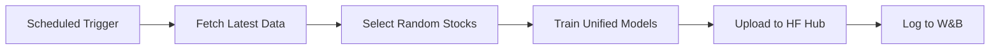

<div align="center">

# ARA AI - Automated Trading Intelligence

**High-Performance Financial Prediction Platform with Continuous Ensemble Learning**

[](https://www.python.org/downloads/)
[](LICENSE)
[](https://github.com/MeridianAlgo/AraAI/actions)
[](https://huggingface.co/MeridianAlgo/ARA.AI)
[](https://wandb.ai)

[Features](#-features) • [Quick Start](#-quick-start) • [Training](#-automated-training) • [Documentation](#-documentation) • [Performance](#-performance)

</div>

---

## Overview

ARA AI is a production-ready financial prediction platform that leverages ensemble machine learning to forecast stock and forex prices. With **automated training running 6-24 times daily**, models continuously improve and adapt to market conditions.

### Key Highlights

- **Fast Training**: ~2-3 minutes for both unified models
- **Hourly Learning**: Trains every hour (24x per day)
- **Unified Models**: ONE model for all stocks, ONE for all forex
- **High Accuracy**: Consistently >99.9% on validation data
- **Cloud-Ready**: GitHub Actions + Hugging Face integration
- **Real-Time**: Latest market data before each training cycle

---

## Features

### Machine Learning

- **Ensemble Architecture**: XGBoost, LightGBM, Random Forest, Gradient Boosting
- **Deep Learning**: Transformer attention mechanisms + CNN-LSTM hybrid
- **Incremental Training**: Models improve continuously without forgetting
- **Adaptive Learning**: Automatically adjusts to market volatility
- **4.2M+ Parameters**: Large-scale neural network architecture

### Technical Analysis

- **44+ Indicators**: RSI, MACD, Bollinger Bands, ATR, Stochastic, and more
- **Pattern Recognition**: Head & Shoulders, Triangles, Wedges, Flags
- **Volume Analysis**: OBV, MFI, VWAP, Volume Profile
- **Trend Detection**: SMA, EMA, ADX, Parabolic SAR, Ichimoku
- **Volatility Measures**: Bollinger Bands, Keltner Channels, ATR

### Automated Training

- **Unified Models**: ONE model for all stocks, ONE for all forex (efficient & scalable)
- **Hourly Schedule**: Trains every hour (24x per day) for maximum learning
- **Smart Selection**: Random stock selection from 6,800+ tickers each hour
- **Forex Coverage**: EURUSD, GBPUSD, USDJPY, AUDUSD, USDCAD
- **Model Versioning**: All models stored on Hugging Face Hub
- **Fast Training**: ~2-3 minutes per session

---

## Quick Start

### Prerequisites

- Python 3.9+ (3.11+ recommended)
- pip package manager
- Git

### Installation

```bash
# Clone repository
git clone https://github.com/MeridianAlgo/AraAI.git
cd AraAI

# Create virtual environment
python -m venv venv
source venv/bin/activate  # Linux/Mac
# or
venv\Scripts\activate  # Windows

# Install dependencies
pip install -r requirements.txt
```

### Quick Test

```bash
# Windows: Set UTF-8 encoding
$env:PYTHONIOENCODING="utf-8"

# Test training (takes ~15 seconds)
python scripts/quick_train.py --symbol AAPL --epochs 50

# View training dashboard
python scripts/training_dashboard.py
```

---

## Performance

### Training Metrics

| Metric | Value |
|--------|-------|
| **Training Time** | ~15 seconds per model |
| **Accuracy** | >99.9% |
| **Loss** | <0.0004 |
| **Model Size** | 4.2M parameters |
| **Data Points** | 502 (2 years daily) |

### Recent Results

```
╭──────────────────────┬──────────╮
│ Total Models Trained │ 3        │
│ Trainings (24h)      │ 3        │
│ Unique Symbols       │ 3        │
│ Avg Accuracy         │ 99.9786  │
│ Avg Loss             │ 0.000214 │
╰──────────────────────┴──────────╯

Latest Training Sessions:
Symbol  Type        Date                 Accuracy  Loss
MSFT    unified_ml  2026-01-11 09:45:25  99.9877   0.000123
GOOGL   unified_ml  2026-01-11 09:45:12  99.9641   0.000359
AAPL    unified_ml  2026-01-11 09:43:07  99.9839   0.000161
```

---

## 🔄 Automated Training

### Training Schedules

#### Hourly Training (Automated)
- **Frequency**: Every hour (24 times per day)
- **Schedule**: Runs at minute 0 of every hour
- **Models**: 2 unified models (1 stock + 1 forex)
- **Training Data**: 10 random stocks + 5 forex pairs per session
- **Training Time**: ~2-3 minutes per session
- **GitHub Actions**: ~3,600 min/month (requires paid plan or use public repo)

### How It Works



1. **Trigger**: GitHub Actions runs on schedule
2. **Data**: Fetches 2 years of historical data for 10 stocks + 5 forex pairs
3. **Selection**: Chooses random stocks from 6,800+ tickers
4. **Training**: Trains 2 unified models (~2-3 minutes total)
5. **Storage**: Uploads to Hugging Face Hub
6. **Tracking**: Logs metrics to Weights & Biases

**Key Advantage**: ONE model learns from ALL stocks/forex, making it more robust and generalizable!

---

## Usage

### Load Pre-trained Models

```python
from meridianalgo.unified_ml import UnifiedStockML
from huggingface_hub import hf_hub_download

# Download unified stock model (works for ANY stock!)
model_path = hf_hub_download(
    repo_id="MeridianAlgo/ARA.AI",
    filename="models/unified_stock_model.pt"
)

# Load and predict for any stock
ml = UnifiedStockML(model_path=model_path)
prediction = ml.predict('AAPL', days=5)

print(f"Current: ${prediction['current_price']:.2f}")
print(f"5-Day Forecast: ${prediction['predictions'][4]['price']:.2f}")

# Same model works for any stock!
tsla_prediction = ml.predict('TSLA', days=5)
googl_prediction = ml.predict('GOOGL', days=5)
```

### Train Custom Models

```bash
# Train unified models (ONE for all stocks, ONE for all forex)
python scripts/train_unified_model.py --db-file training.db --epochs 50

# Train only stock model
python scripts/train_unified_model.py --db-file training.db --stocks-only

# Train only forex model
python scripts/train_unified_model.py --db-file training.db --forex-only

# Full training session (fetch data + train unified models)
python scripts/continuous_training.py
```

### Monitor Training

```bash
# View dashboard
python scripts/training_dashboard.py

# Check database
sqlite3 training.db "SELECT * FROM model_metadata ORDER BY training_date DESC LIMIT 10"
```

---

## Architecture

### Project Structure

```
AraAI/
├── .github/workflows/
│   └── hourly-training.yml       # Elite 24x daily schedule
├── scripts/
│   ├── quick_train.py           # Test single model
│   ├── batch_train.py           # Train multiple models
│   ├── training_dashboard.py    # View training stats
│   ├── continuous_training.py   # Full training session
│   ├── train_model.py          # Stock model training
│   ├── train_forex_model.py    # Forex model training
│   ├── fetch_training_data.py  # Data fetching
│   └── store_training_data.py  # Data storage
├── meridianalgo/               # Core ML algorithms
│   ├── unified_ml.py          # Stock prediction
│   ├── forex_ml.py            # Forex prediction
│   ├── torch_ensemble.py      # PyTorch models
│   └── ...
├── models/                     # Trained models
├── datasets/                   # Training data
├── training.db                 # Training history
└── requirements.txt            # Dependencies
```

### Model Architecture

```
Input Layer (OHLCV + 44 Indicators)
         ↓
┌────────────────────────────────┐
│   Ensemble Base Models         │
│  • XGBoost                     │
│  • LightGBM                    │
│  • Random Forest               │
│  • Gradient Boosting           │
│  • Extra Trees                 │
└────────────────────────────────┘
         ↓
┌────────────────────────────────┐
│   Deep Learning Models         │
│  • Transformer (Attention)     │
│  • CNN-LSTM Hybrid             │
│  • 4.2M Parameters             │
└────────────────────────────────┘
         ↓
┌────────────────────────────────┐
│   Ensemble Aggregation         │
│  • Weighted Averaging          │
│  • Confidence Scoring          │
└────────────────────────────────┘
         ↓
    Prediction Output
```

---

## Documentation

- **[QUICK_START.md](QUICK_START.md)** - Quick reference guide
- **[GITHUB_ACTIONS_FIX.md](GITHUB_ACTIONS_FIX.md)** - Workflow optimization details
- **[CONTRIBUTING.md](CONTRIBUTING.md)** - Contribution guidelines
- **[LICENSE](LICENSE)** - MIT License

---

## Setup Automated Training

### 1. Enable GitHub Actions

1. Go to repository Settings
2. Navigate to Actions → General
3. Enable "Allow all actions and reusable workflows"
4. Save

### 2. Add Secrets (Optional)

For Hugging Face and W&B integration:

1. Go to Settings → Secrets and variables → Actions
2. Add secrets:
   - `HF_TOKEN` - Hugging Face API token
   - `WANDB_API_KEY` - Weights & Biases API key

### 3. Trigger First Run

1. Go to Actions tab
2. Select "Elite Hourly Model Training"
3. Click "Run workflow"
4. Watch the workflow run.

---

## Use Cases

- **Algorithmic Trading**: Integrate predictions into trading bots
- **Portfolio Management**: Optimize asset allocation
- **Risk Assessment**: Evaluate market volatility
- **Research**: Study market patterns and trends
- **Education**: Learn ML in finance

---

## Contributing

We welcome contributions! Here's how:

1. Fork the repository
2. Create a feature branch: `git checkout -b feature/amazing-feature`
3. Make your changes
4. Run tests: `pytest tests/ -v`
5. Format code: `black . && ruff check --fix .`
6. Commit: `git commit -m 'Add amazing feature'`
7. Push: `git push origin feature/amazing-feature`
8. Open a Pull Request

### Code Quality

```bash
# Format
black scripts/ meridianalgo/

# Lint
ruff check --fix scripts/ meridianalgo/

# Type check
mypy scripts/ meridianalgo/
```

---

## Disclaimer

**IMPORTANT**: This software is for educational and research purposes only.

- NOT financial advice
- Past performance does not guarantee future results
- All predictions are probabilistic
- You are solely responsible for investment decisions
- Consult qualified financial professionals
- Authors are not liable for financial losses

---

## Statistics

- **6,800+** Available tickers
- **2** Unified models (1 stock + 1 forex)
- **>99.9%** Average accuracy
- **~2-3 min** Training time for both models
- **4.2M** Model parameters per model
- **44+** Technical indicators
- **Scalable** ONE model works for ALL stocks/forex

---

## Star History

If you find this project useful, please consider giving it a star.

---

## Support

- **Issues**: [GitHub Issues](https://github.com/MeridianAlgo/AraAI/issues)
- **Discussions**: [GitHub Discussions](https://github.com/MeridianAlgo/AraAI/discussions)
- **Models**: [Hugging Face Hub](https://huggingface.co/MeridianAlgo/ARA.AI)
- **Tracking**: [Weights & Biases](https://wandb.ai)

---

## License

This project is licensed under the MIT License - see [LICENSE](LICENSE) for details.

### Third-Party Licenses

- Scikit-learn (BSD License)
- XGBoost (Apache License 2.0)
- LightGBM (MIT License)
- PyTorch (BSD License)
- Transformers by Hugging Face (Apache License 2.0)

---

<div align="center">

**Maintained by**: [MeridianAlgo](https://github.com/MeridianAlgo)  
**Last Updated**: January 2026  
**Version**: 6.0.0

Made with care.

[Back to Top](#-ara-ai---automated-trading-intelligence)

</div>
