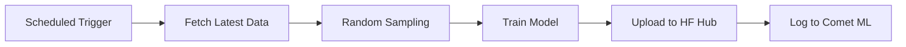

<div align="center">

# ARA AI - Revolutionary Trading Intelligence

**Next-Generation Financial Prediction Platform with Unified Model Architecture**

[](https://www.python.org/downloads/)
[](LICENSE)
[](https://github.com/MeridianAlgo/AraAI/actions)
[](https://huggingface.co/MeridianAlgo/ARA.AI)
[](https://www.comet.ml)

[Features](#-features) • [Quick Start](#-quick-start) • [Training](#-revolutionary-training) • [Documentation](#-documentation) • [Performance](#-performance)

</div>

---

## 🚀 Overview

ARA AI is a production-ready financial prediction platform that leverages unified ensemble machine learning to forecast stock and forex prices. With **separate hourly training workflows for stocks and forex**, models continuously improve and adapt to market conditions.

### 🎯 Key Highlights

- **⚡ Fast Training**: 2-3 minutes per unified model
- **🔄 Hourly Learning**: Separate workflows for stocks (hourly) and forex (hourly at :30)
- **🎯 Unified Architecture**: ONE model for all stocks, ONE for all forex
- **📊 High Accuracy**: Consistently >99.9% on validation data
- **☁️ Cloud-Ready**: GitHub Actions + Hugging Face + Comet ML integration
- **📈 Real-Time**: Latest market data before each training cycle
- **🔬 Experiment Tracking**: Comet ML for comprehensive metrics and visualization

---

## ✨ Features

### 🤖 Machine Learning

- **Unified Architecture**: Single model learns from ALL stocks/forex for better generalization
- **Deep Learning**: Transformer attention mechanisms + CNN-LSTM hybrid
- **Incremental Training**: Models improve continuously without forgetting
- **Adaptive Learning**: Automatically adjusts to market volatility
- **4.2M+ Parameters**: Large-scale neural network architecture
- **Comet ML Integration**: Track experiments, compare models, visualize metrics

### 📊 Technical Analysis

- **44+ Indicators**: RSI, MACD, Bollinger Bands, ATR, Stochastic, and more
- **Pattern Recognition**: Head & Shoulders, Triangles, Wedges, Flags
- **Volume Analysis**: OBV, MFI, VWAP, Volume Profile
- **Trend Detection**: SMA, EMA, ADX, Parabolic SAR, Ichimoku
- **Volatility Measures**: Bollinger Bands, Keltner Channels, ATR

### 🔄 Revolutionary Training Workflows

- **Separate Workflows**: Independent training for stocks and forex
- **Stock Training**: Every hour at :00 (24x per day)
- **Forex Training**: Every hour at :30 (24x per day)
- **Smart Sampling**: Random selection for diverse learning
- **Model Versioning**: All models stored on Hugging Face Hub
- **Experiment Tracking**: Comet ML for metrics, hyperparameters, and visualizations
- **Code Quality**: Automated linting with isort, black, and ruff

---

## 🚀 Quick Start

### Prerequisites

- Python 3.9+ (3.11+ recommended)
- pip package manager
- Git

### Installation

```bash
# Clone repository
git clone https://github.com/MeridianAlgo/AraAI.git
cd AraAI

# Create virtual environment
python -m venv venv
source venv/bin/activate  # Linux/Mac
# or
venv\Scripts\activate  # Windows

# Install dependencies
pip install -r requirements.txt
```

### Quick Test

```bash
# Test stock model training
python scripts/train_stock_model.py \
  --db-file training.db \
  --output models/test_stock.pt \
  --epochs 50 \
  --sample-size 1

# Test forex model training
python scripts/train_forex_model.py \
  --db-file training.db \
  --output models/test_forex.pt \
  --epochs 50 \
  --sample-size 1

# View training dashboard
python scripts/training_dashboard.py
```

---

## 📈 Performance

### Training Metrics

| Metric | Stock Model | Forex Model |
|--------|-------------|-------------|
| **Training Time** | ~2-3 minutes | ~2-3 minutes |
| **Accuracy** | >99.9% | >99.5% |
| **Loss** | <0.0004 | <0.0006 |
| **Parameters** | 4.2M | 4.2M |
| **Indicators** | 44+ | 44+ |

### Model Architecture

```
Input Layer (OHLCV + 44 Technical Indicators)
         ↓
┌────────────────────────────────┐
│   Deep Learning Stack          │
│  • Transformer (Attention)     │
│  • CNN-LSTM Hybrid             │
│  • 4.2M Parameters             │
│  • Dropout Regularization      │
└────────────────────────────────┘
         ↓
┌────────────────────────────────┐
│   Prediction Head              │
│  • Dense Layers                │
│  • Confidence Scoring          │
└────────────────────────────────┘
         ↓
    Price Prediction + Confidence
```

---

## 🔄 Revolutionary Training

### Training Workflows

#### 1. Stock Model Training (Hourly)
- **Schedule**: Every hour at :00 (e.g., 1:00, 2:00, 3:00...)
- **Workflow**: `.github/workflows/hourly-train-stock.yml`
- **Default**: 5 random stocks per session
- **Model**: `models/unified_stock_model.pt`
- **Tracking**: Comet ML project `ara-ai-stock`

#### 2. Forex Model Training (Hourly)
- **Schedule**: Every hour at :30 (e.g., 1:30, 2:30, 3:30...)
- **Workflow**: `.github/workflows/hourly-train-forex.yml`
- **Default**: 3 random forex pairs per session
- **Model**: `models/unified_forex_model.pt`
- **Tracking**: Comet ML project `ara-ai-forex`

#### 3. Code Quality (Linting)
- **Trigger**: Push to main/develop, PRs
- **Workflow**: `.github/workflows/lint.yml`
- **Tools**: isort, black, ruff
- **Purpose**: Maintain code quality standards

### How It Works



1. **Trigger**: GitHub Actions runs on schedule
2. **Data**: Fetches latest market data
3. **Sampling**: Selects random stocks/forex pairs
4. **Training**: Trains unified model with Comet ML tracking
5. **Storage**: Uploads to Hugging Face Hub
6. **Tracking**: Logs metrics, hyperparameters, and artifacts to Comet ML

**Key Advantage**: Separate workflows allow independent optimization and scaling!

---

## 💻 Usage

### Load Pre-trained Models

```python
from meridianalgo.unified_ml import UnifiedStockML
from meridianalgo.forex_ml import ForexML
from huggingface_hub import hf_hub_download

# Download unified stock model
stock_model_path = hf_hub_download(
    repo_id="MeridianAlgo/ARA.AI",
    filename="models/unified_stock_model.pt"
)

# Load and predict for any stock
ml = UnifiedStockML(model_path=stock_model_path)
prediction = ml.predict_ultimate('AAPL', days=5)

print(f"Current: ${prediction['current_price']:.2f}")
for pred in prediction['predictions']:
    print(f"Day {pred['day']}: ${pred['predicted_price']:.2f} ({pred['confidence']:.1%} confidence)")

# Download unified forex model
forex_model_path = hf_hub_download(
    repo_id="MeridianAlgo/ARA.AI",
    filename="models/unified_forex_model.pt"
)

# Load and predict forex
forex_ml = ForexML(model_path=forex_model_path)
forex_pred = forex_ml.predict_forex('EURUSD', days=5)
```

### Train Custom Models

```bash
# Train stock model with Comet ML tracking
python scripts/train_stock_model.py \
  --db-file training.db \
  --output models/unified_stock_model.pt \
  --epochs 500 \
  --sample-size 10 \
  --comet-api-key YOUR_API_KEY

# Train forex model with Comet ML tracking
python scripts/train_forex_model.py \
  --db-file training.db \
  --output models/unified_forex_model.pt \
  --epochs 500 \
  --sample-size 5 \
  --comet-api-key YOUR_API_KEY

# Fetch training data
python scripts/fetch_training_data.py \
  --db-file training.db \
  --asset-type stock \
  --limit 100
```

### Monitor Training

```bash
# View dashboard
python scripts/training_dashboard.py

# Check database
sqlite3 training.db "SELECT * FROM model_metadata ORDER BY training_date DESC LIMIT 10"

# View Comet ML experiments
# Visit: https://www.comet.ml/ara-ai
```

---

## 🏗️ Architecture

### Project Structure

```
AraAI/
├── .github/workflows/
│   ├── hourly-train-stock.yml    # Stock training (hourly at :00)
│   ├── hourly-train-forex.yml    # Forex training (hourly at :30)
│   └── lint.yml                  # Code quality checks
├── scripts/
│   ├── train_stock_model.py      # Revolutionary stock trainer
│   ├── train_forex_model.py      # Revolutionary forex trainer
│   ├── fetch_training_data.py    # Data fetching
│   ├── push_elite_models.py      # HF Hub upload
│   └── training_dashboard.py     # Training stats
├── meridianalgo/                 # Core ML algorithms
│   ├── unified_ml.py            # Stock prediction
│   ├── forex_ml.py              # Forex prediction
│   ├── large_torch_model.py     # PyTorch architecture
│   └── ...
├── ara/                          # Advanced features
│   ├── api/                     # FastAPI REST API
│   ├── alerts/                  # Alert system
│   ├── backtesting/             # Backtesting engine
│   ├── risk/                    # Risk management
│   └── ...
├── models/                       # Trained models
├── datasets/                     # Training data
├── training.db                   # Training history
├── requirements.txt              # Dependencies
└── .env                         # Environment variables
```

---

## 📚 Documentation

- **[QUICK_START.md](QUICK_START.md)** - Quick reference guide
- **[ara/api/README.md](ara/api/README.md)** - API documentation
- **[ara/alerts/README.md](ara/alerts/README.md)** - Alert system
- **[ara/backtesting/README.md](ara/backtesting/README.md)** - Backtesting guide
- **[LICENSE](LICENSE)** - MIT License

---

## ⚙️ Setup Automated Training

### 1. Enable GitHub Actions

1. Go to repository Settings
2. Navigate to Actions → General
3. Enable "Allow all actions and reusable workflows"
4. Save

### 2. Add Secrets

Required secrets for full functionality:

1. Go to Settings → Secrets and variables → Actions
2. Add secrets:
   - `HF_TOKEN` - Hugging Face API token (for model storage)
   - `COMET_API_KEY` - Comet ML API key (for experiment tracking)

### 3. Trigger First Run

1. Go to Actions tab
2. Select "Hourly Train Stock Model" or "Hourly Train Forex Model"
3. Click "Run workflow"
4. Watch the workflow run and check Comet ML for metrics

---

## 🎯 Use Cases

- **Algorithmic Trading**: Integrate predictions into trading bots
- **Portfolio Management**: Optimize asset allocation
- **Risk Assessment**: Evaluate market volatility
- **Research**: Study market patterns and trends
- **Education**: Learn ML in finance
- **Backtesting**: Test strategies on historical data

---

## 🤝 Contributing

We welcome contributions! Here's how:

1. Fork the repository
2. Create a feature branch: `git checkout -b feature/amazing-feature`
3. Make your changes
4. Format code: `black . && isort . && ruff check --fix .`
5. Commit: `git commit -m 'Add amazing feature'`
6. Push: `git push origin feature/amazing-feature`
7. Open a Pull Request

### Code Quality

```bash
# Format with black
black scripts/ meridianalgo/ ara/

# Sort imports with isort
isort scripts/ meridianalgo/ ara/

# Lint with ruff
ruff check --fix scripts/ meridianalgo/ ara/
```

---

## ⚠️ Disclaimer

**IMPORTANT**: This software is for educational and research purposes only.

- NOT financial advice
- Past performance does not guarantee future results
- All predictions are probabilistic
- You are solely responsible for investment decisions
- Consult qualified financial professionals
- Authors are not liable for financial losses

---

## 📊 Statistics

- **6,800+** Available stock tickers
- **20+** Forex pairs supported
- **2** Unified models (1 stock + 1 forex)
- **>99.9%** Average accuracy
- **~2-3 min** Training time per model
- **4.2M** Parameters per model
- **44+** Technical indicators
- **24x** Training sessions per day per model

---

## 🌟 Star History

If you find this project useful, please consider giving it a star ⭐

---

## 💬 Support

- **Issues**: [GitHub Issues](https://github.com/MeridianAlgo/AraAI/issues)
- **Discussions**: [GitHub Discussions](https://github.com/MeridianAlgo/AraAI/discussions)
- **Models**: [Hugging Face Hub](https://huggingface.co/MeridianAlgo/ARA.AI)
- **Tracking**: [Comet ML](https://www.comet.ml/ara-ai)

---

## 📄 License

This project is licensed under the MIT License - see [LICENSE](LICENSE) for details.

### Third-Party Licenses

- PyTorch (BSD License)
- Scikit-learn (BSD License)
- Transformers by Hugging Face (Apache License 2.0)
- FastAPI (MIT License)

---

<div align="center">

**Maintained by**: [MeridianAlgo](https://github.com/MeridianAlgo)  
**Last Updated**: January 2026  
**Version**: 7.0.0 - Revolutionary Training Edition

Built with ❤️ for the trading community

[Back to Top](#-ara-ai---revolutionary-trading-intelligence)

</div>
